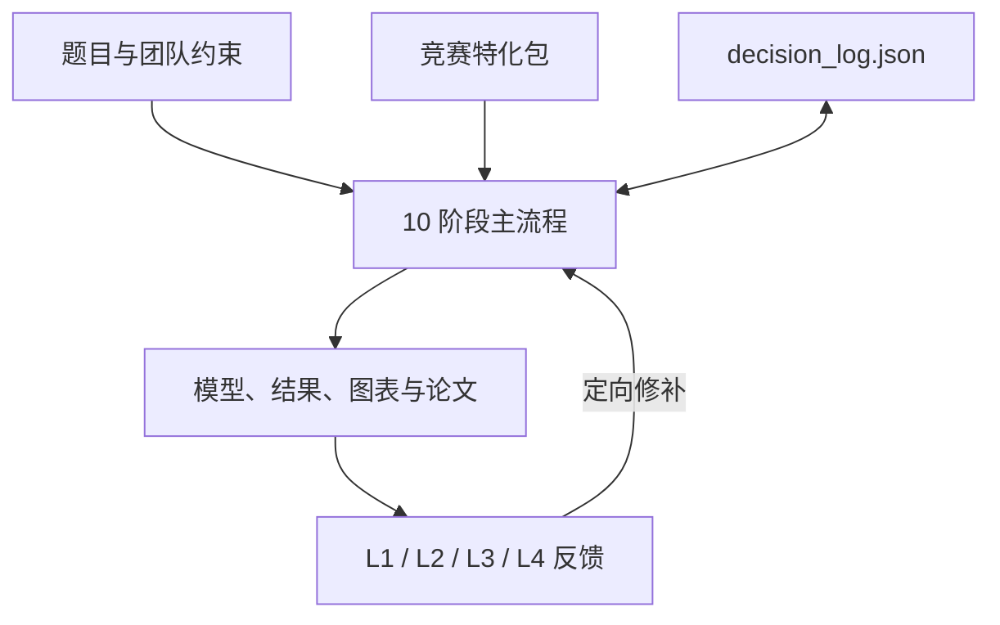

# mathmodel-skill

> 把 72–96 小时的数学建模协作，变成一条可恢复、可检查、可交付的流程。

[](./.codex-plugin/plugin.json)
[](https://github.com/handsomeZR-netizen/mathmodel-skill/actions/workflows/ci.yml)
[](./scripts/doctor.py)
[](./competitions/)
[](./LICENSE)

mathmodel-skill 是面向 CUMCM、MCM/ICM 与电工杯的 Agent 工作流。它把选题、拆题、模型选择、求解、稳健性、写作和终审串成 10 个阶段，并用一份可读的决策日志，让团队在长时间、高压力的协作里依然知道：我们做过什么、为什么这样做、下一步该检查什么。

支持 Codex Skills、Codex Plugin 与 Claude Code。核心流程不要求你手工维护 JSON，也不要求你记住每个脚本的参数；关键节点由 Agent 用编号选项与你确认，状态和产物由流程接住。

[为什么要做](#凌晨两点之后真正难的是什么) · [设计取舍](#为什么不是其他几种做法) · [精心设计](#一些刻意做小但很重要的设计) · [快速开始](#quick-start) · [可信边界](#边界与可信度)

## 凌晨两点之后，真正难的是什么

代码终于跑出了结果。可队友正在使用另一套符号，摘要仍然引用下午已经放弃的模型，灵敏度分析还没有开始。

数学建模论文不是一次回答，而是一串有前后依赖的决定：选题决定数据和方法，假设决定模型边界，模型决定结果，结果又决定摘要里能不能写出可信的数字。单次回答可以很聪明，但如果这些依赖只留在聊天窗口里，一次上下文切换就足以让它们脱节。

mathmodel-skill 从这里出发。它不试图成为“最会答题的 Prompt”，而是把一场比赛中容易遗忘的流程、决策和检查点，写成一套可以执行、恢复和复核的工作协议。

它做三件事：

- 把流程显式化：从团队启动到提交前终审，10 个阶段各自有输入、产出和退出条件。
- 把决策显式化：选了哪道题、为何放弃另一模型、哪个假设影响了哪些子问，都进入 `state/decision_log.json`，而不是沉在聊天记录里。
- 把质量检查显式化：阶段内评分、跨阶段一致性回检、终稿多视角评审与合规门各司其职；发现问题时优先定向修补，不轻易整篇重来。

它不替团队做出正确模型，也不承诺奖项。它解决的是另一个更现实的问题：不让关键假设丢失，不让符号悄悄漂移，也不让某个薄弱子问被整篇平均分掩盖。

## 从题目到终稿，只有一条共享主线



主流程负责阶段顺序和状态；`competitions/<comp>/` 负责竞赛规则、写作模式、评分覆盖与 LaTeX 模板；辅助脚本负责可重复的评分、差分应用、预检、装配和 AI 使用披露。模型仍然由团队判断，脚本只把能确定的部分做得确定。

## 这套流程实际带来了什么

| 竞赛现场的常见问题 | mathmodel-skill 的处理方式 |
|---|---|
| 聊天一长，之前的选择和理由找不到 | 所有阶段共用 `decision_log.json`，记录选题、模型、假设、分数、回退与交付状态 |
| 高分项掩盖一个致命短板 | Verdict 同时检查原始最低分与加权均分；高严重度问题直接阻断 |
| Q2 出问题，却把 Q1/Q3 一起重做 | Stage 5 按子问保存状态，支持 `refine_partial` 只回修薄弱 Qi |
| 三类比赛格式不同，流程被复制成三套 | 保留一条主流程，用 competition pack、权重 overlay 与模板表达差异 |
| 正文分节已生成，主 TeX 却没有引用 | 三类竞赛模板统一使用显式 section marker；渲染器遇到缺失、重复或未知 marker 会失败 |
| 封面或摘要页还留着 `XXXX`，却被误当作终稿 | 正式渲染要求提交元数据完整；占位符只能进入显式 dry-run，不能编译成提交 PDF |
| 到提交前才发现页数、匿名或 AI 披露不合规 | Stage 0/8/9 重开当届规则；合规先于润色，违规状态不能进入 `submission_ready` |
| 环境问题在最后一刻才暴露 | `doctor.py` 一次检查结构、Python、竞赛包、Pandoc、TeX 与可选建模依赖 |

## 为什么不是其他几种做法

### 不是一个更长的万能 Prompt

泛用 Prompt 很适合解释概念、生成候选方案或修改一段文字。但竞赛是一条持续数十小时的长链任务，主要风险并不是提示词不够长，而是状态、依赖关系和退出条件没有被写出来。

mathmodel-skill 仍然用模型完成每个局部任务，只是把“现在处于哪一步、上一阶段决定了什么、什么条件下才能继续”移到结构化工作流里。

### 不把 RAG 当成流程引擎

RAG 擅长回答“相关资料在哪里”，却不会自然回答“下一步该做什么”或“这个结果是否推翻了之前的假设”。仓库内材料规模有限且结构清晰，因此采用版本可控、按阶段加载的竞赛包。需要最新规则、领域论文或真实数据时，检索仍然重要，但它是证据来源，不是状态机。

### 不默认在每一步堆满 Multi-Agent

多 Agent 很适合并行比较题目、攻击模型假设或从不同评委视角审稿；如果每一步都由多个 Agent 协商，协调成本、上下文重复和符号不一致也会随之增加。

因此主流程始终围绕一份共享决策日志推进，只在适合独立比较的环节启用并行视角。终稿 Panel 可以并行运行，也可以在单 Agent 环境中串行降级。

### 不把整场比赛交给一个“一键成稿”的黑盒 Agent

单体 Agent 并不是不能用；`fast` 和 `standard` 模式都可以在单 Agent 环境中完成。我们拒绝的，是把选题、建模、求解和写作压成一次不可观察的长执行。

一键成稿看起来更快，但当某个假设出错时，团队很难判断它影响了哪一道子问、哪张图和摘要里的哪一句结论；中途换人、换模型或人工接管，也往往只能从头再来。

mathmodel-skill 把自动化停在可检查的位置：每个阶段留下明确产物，关键选择由人确认，评分由脚本重算，问题以 section 或 Qi 为单位回修。Agent 仍然完成大量工作，但团队随时知道它做到了哪里、依据是什么，以及怎样安全地继续。

这些方法并不互斥。我们的选择只是让它们各自在最擅长的位置出现，不让技术栈本身成为比赛的新负担。

## 一些刻意做小、但很重要的设计

1. **聊天用于交流，决策日志用于接力。** Codex 与 Claude Code 可以在同一工作区读取同一份 state schema；这不是云同步，切换工具时仍要保留项目目录和产物。

2. **用户回答问题，Agent 维护流程。** 选竞赛、选题、选模型、接受或回修等关键决定使用原生选择 UI 或编号列表；Agent 负责读写状态和调用脚本。

3. **只加载当前阶段。** 根 `SKILL.md` 是调度层，阶段细节、rubric 与竞赛包按需读取，避免把无关材料塞进同一个上下文。

4. **同一主流程，不复制三套产品。** CUMCM、MCM/ICM 与电工杯的差异分别落在 `competitions/<comp>/`、题型权重与 LaTeX 模板里。

5. **最低分与加权均分一起看。** 优势维度可以影响排序，但不能把一个低于门槛的维度平均掉；权重还会被限制在 `[0.7, 1.5]`，避免题型偏好失控。

6. **一个子问失败，不推翻所有子问。** Stage 5 保留每个 Qi 的分数、权重和状态，只回到需要修改的那一问。

7. **经验数据是锚点，不是神谕。** CUMCM 分位用于描述样本中的观察位置，不是官方评分线，更不能推导获奖概率；MCM/电工杯明确记录为 `n=0`，不生成看似精确的合成分位。

8. **规则是活的，所以规则有日期。** `current_rules.md` 记录最近核对日期和官方入口；Stage 0/8/9 仍要求重新打开当届通知，仓库基线不能覆盖官方规则。

9. **AI 使用从过程里记，不在截止前回忆。** 台账记录工具、版本、使用环节、用途、完整交互或用途披露、采用内容与人工复核；CUMCM 会按是否使用 AI 分流为详情 PDF 或参考文献后声明，MCM 报告会直接接入主模板。

10. **能自动检查的地方不依赖“记得”。** YAML/JSON、竞赛包、反模式计数、评分边界、模板 marker、渲染 dry-run 与代码模板边界都有自动测试。

## 三类竞赛，一条工作流

| 竞赛包 | 语言与模板 | 当前材料 | 可信度说明 |
|---|---|---|---|
| **CUMCM 国赛** | 中文；XeLaTeX / 原创 `ctexart` 电子论文模板 | 收集 91 份公开论文源样本，其中 59 份成功提取文本并进入统计；42 项维护者反模式检查 | 当前最完整；观察分位不是官方门槛，规则以当届国赛通知为准 |
| **MCM/ICM 美赛** | English；pdfLaTeX / `article` | 16 项维护者检查；已记录 COMAP 2027 页数、字号与 AI 披露基线 | 经验层 `n=0`，不提供论文分位；提交前必须重查 COMAP |
| **电工杯** | 中文；XeLaTeX / `ctexart` | 12 项工程导向检查；已记录官网页序、25 页正文、支撑材料与匿名基线 | 经验层 `n=0`；当前官网页面未给专门 AI 格式，仍须检查当届通知 |

截至 2026-07-22，仓库已核对 [CUMCM 2026 竞赛规则](https://www.mcm.edu.cn/html_cn/node/9d8e511fe7a1447b35f53a82c908e2e0.html)、[CUMCM 2026 论文格式规范](https://www.mcm.edu.cn/html_cn/node/4cd596519c9eb9fbd866398f6df0caa3.html)、[COMAP 2027 Instructions](https://www.contest.comap.com/undergraduate/contests/mcm/instructions.php)、[电工杯参赛规则](https://shumo.neepu.edu.cn/jszz/csgz.htm) 与 [电工杯论文规范](https://shumo.neepu.edu.cn/jszz/lwgf.htm)。这些链接是基线，不替代你参赛当年的官方文件。

## 10 个阶段如何收敛

| Stage | 任务 | 关键产物 | 主要检查 |
|---:|---|---|---|
| 0 | 团队启动与资料预扫 | 竞赛、角色、时限、环境、规则基线 | 可执行性与合规入口 |
| 1 | 多题比较与选题 | 选择理由、放弃项、题型 | 资源匹配与失败风险 |
| 2 | 问题拆解 | 子问、变量、约束、依赖图 | 逻辑完整性 |
| 3 | 模型选型 | 有证据支撑的候选、反事实与淘汰理由 | 模型—问题匹配 |
| 4 | Foundation | 假设、符号、术语表 | 一致性与可解释性 |
| 5 | 递归求解 Q1…Qn | formulation、代码、结果、图表 | per-Qi 评分与定向回修 |
| 6 | 稳健性 | 与模型风险匹配的验证、稳健区间、失败边界 | 灵敏度与结论可靠性 |
| 7 | 模型评价 | 优点、局限、改进、迁移条件 | 诚实边界与推广性 |
| 8 | 论文装配 | `paper_workspace/*.md`、TeX/PDF、AI 台账 | 跨阶段一致性与格式合规 |
| 9 | 提交前终审 | 最终 PDF、支持材料、Panel 记录 | 合规门、证据链、视觉检查 |

三种模式只改变预算和反馈深度，不改变竞赛分支：

| Mode | 反馈层 | 适用场景 |
|---|---|---|
| `fast` | L1 单轮 | 选题试跑、紧急 sanity check |
| `standard` | L1 + L2 | 默认主流程 |
| `championship` | L1 + L2 + L3 + L4 + red-team | 终稿前的深度检查 |

评分工具给出的是流程 verdict，不是奖项预测：`block`、`refine`、`refine_partial`、`pass_with_review`、`pass`、`pass_early` 或 `carryover`。

## Quick Start

### Codex

#### macOS / Linux

```bash
git clone https://github.com/handsomeZR-netizen/mathmodel-skill.git \
  ~/.agents/skills/mathmodel-skill

python ~/.agents/skills/mathmodel-skill/scripts/doctor.py \
  --competition cumcm

mkdir -p my-modeling-project
cd my-modeling-project
codex
```

#### Windows PowerShell

```powershell
git clone https://github.com/handsomeZR-netizen/mathmodel-skill.git `
  "$HOME\.agents\skills\mathmodel-skill"

python "$HOME\.agents\skills\mathmodel-skill\scripts\doctor.py" `
  --competition cumcm

New-Item -ItemType Directory -Force my-modeling-project | Out-Null
Set-Location my-modeling-project
codex
```

然后说：

```text
使用 $mathmodel-skill，开始 CUMCM 建模。
```

第一次启动不会直接生成整篇论文。Agent 会先确认竞赛、题目、队伍能力、截止时间与题面位置，再建立共享状态并进入 Stage 0；已有状态时则从上次检查点继续。

项目级安装也可以：

```bash
mkdir -p .agents/skills
git clone https://github.com/handsomeZR-netizen/mathmodel-skill.git \
  .agents/skills/mathmodel-skill
```

### Claude Code

```bash
git clone https://github.com/handsomeZR-netizen/mathmodel-skill.git \
  ~/.claude/skills/mathmodel-skill

mkdir -p my-modeling-project
cd my-modeling-project
claude
```

然后说“开始建模”或“使用 mathmodel-skill 开始 MCM 建模”。

### 可选的完整数值环境

核心工作流和 `doctor.py --skip-tools` 不需要安装整套科学计算栈。需要运行仓库的建模起步代码时，再安装：

```bash
python -m pip install -r \
  ~/.agents/skills/mathmodel-skill/templates/shared/requirements.txt
```

正式论文转换与编译还需要按平台安装 [Pandoc](https://pandoc.org/installing.html) 和 TeX Live / MiKTeX；简化转换器只用于 `--no-compile` 结构预检。CUMCM 与电工杯使用 XeLaTeX，MCM 使用 pdfLaTeX。

## Agent 会在工作区留下什么

```text
my-modeling-project/
├── state/
│   └── decision_log.json       # 决策、分数、回退、规则与 AI 使用台账
├── results/                    # 结构化结果与可复现实验输出
├── figures/                    # 最终图表
├── paper_workspace/            # 01_abstract.md … 10_appendix.md，以及按需披露片段
├── paper_output/               # TeX 中间文件与最终 PDF
└── support_materials/          # 代码、数据清单与竞赛要求的披露材料
```

同一目录可以在 Codex 与 Claude Code 之间接力；`decision_log.json` 只负责状态，不会替你同步外部文件。

## 可重复的辅助工具

| 工具 | 用途 | 典型调用 |
|---|---|---|
| `scripts/doctor.py` | 检查 skill 结构、竞赛包、环境与工作区 | `python <skill>/scripts/doctor.py --competition mcm` |
| `scripts/score_artifact.py` | 校验 critic JSON、重算加权分数和 verdict、聚合 per-Qi | `python <skill>/scripts/score_artifact.py ...` |
| `scripts/extract_diff.py` | 生成并应用 section-level patch | `python <skill>/scripts/extract_diff.py --apply ...` |
| `scripts/render_paper.py` | 把标准 Markdown 工作区装配成三竞赛 TeX/PDF | `python <skill>/scripts/render_paper.py --competition cumcm --workspace paper_workspace` |
| `scripts/render_ai_usage.py` | 从台账生成 CUMCM/MCM 披露材料 | `python <skill>/scripts/render_ai_usage.py --competition mcm ...` |
| `scripts/ingest_papers.py` | 维护者离线更新经验统计 | 见 [`scripts/README.md`](./scripts/README.md) |

CLI 参数与依赖边界集中记录在 [`scripts/README.md`](./scripts/README.md)。

## 仓库结构

```text
SKILL.md                         # 工作流唯一主入口与调度协议
agents/openai.yaml               # Codex UI 元数据
.codex-plugin/plugin.json        # Codex Plugin manifest
skills/mathmodel-skill/SKILL.md  # Plugin 发现 shim
AGENTS.md                        # 本仓库维护约定
competitions/
  cumcm/                         # 规则、59 样本统计、写作启发、评分覆盖、模板骨架
  mcm/                           # COMAP 规则基线；经验统计 n=0
  diangong/                      # 官网规则基线；工程经验统计 n=0
references/
  stage_00_* ... stage_09_*      # 按阶段懒加载的执行细则
  feedback_layer1_* ... layer4_* # 阶段评分、回检、Panel、校准
  model_catalog.md               # 模型候选目录
templates/
  latex/{cumcm,mcm,diangong}/    # 三竞赛 LaTeX 模板
  shared/                        # 状态、AI 台账、表格与 Python 起步代码
config/dim_weights.json          # 竞赛 × 题型 × 阶段的评分权重
scripts/                         # doctor、评分、差分、装配、披露与维护工具
tests/                           # 回归测试与 fixture
```

## v6.1：这次不只是换了一份 README

- 引入 `doctor.py`，把包结构、竞赛包、反模式计数、模板 marker 与工具链预检收在一个入口。
- 三类竞赛生成的 section 现在统一自动接入 `main.tex`；缺失/空章节、未知或重复 marker 都会明确失败，正式编译不会悄悄降级为简化转换。
- CUMCM 改用仓库原创、MIT 授权的 `ctexart` 电子论文模板；模板不含身份字段，并对摘要页、正文页数和最终元数据做 fail-closed 检查。
- 评分器以脚本重算 verdict，并校验 stage、iteration、最低分、均分与题型权重；修复了持久化旧 verdict 的问题。
- `extract_diff.py --apply` 不再要求无关的 critique 输入。
- 加入 AI 使用台账与披露生成器：CUMCM 按“已使用 / 明确未使用”分别生成支撑材料 PDF 或正文声明，MCM 报告自动放进模板且不会重复标题。
- 补齐电工杯官网规则基线，并让封面、摘要起始页码、无目录、正文与附录顺序进入模板和终审门。
- 修复分类交叉验证中的标准化泄漏、优化示例中的不可行贪心基线、熵权法常数列、GM(1,1) 极限和 MAPE 零值边界。
- 校准 CUMCM 样本口径为“91 份来源、59 份可提取”；三套反模式清单在 Stage 9 按当前竞赛动态初始化，不再把某一赛制的数量写死进共享状态。
- 加入自动测试和 GitHub Actions，覆盖配置、评分、模板装配、AI 披露与数值边界。

## 边界与可信度

- 本项目是协作与质量控制工作流，不是自动获奖系统，也不应替代团队的独立建模、验证与署名责任。
- CUMCM 统计来自公开样本中的 59 份可提取文本，存在年份、题型、来源与 PDF 可提取性偏差。
- `winning_patterns.md`、经验分位和反模式清单是维护者启发，不是官方 rubric。
- MCM/ICM 与电工杯经验统计均明确为 `n=0`；其中写作模式是维护者启发，不能按“实测获奖规律”使用。
- 规则会变化。仓库记录的是最近核对的基线；提交前必须以当届官方通知和题目要求为准。
- AI 生成的公式、代码、事实与引用必须由团队复核；台账和报告生成器只帮助完整披露，不替代合规判断。

## 开发与验证

```bash
python -m compileall -q scripts templates/shared/code_starter
python -m unittest discover -s tests -p 'test_*.py' -v
python scripts/doctor.py --competition cumcm --skip-tools
python scripts/doctor.py --competition mcm --skip-tools
python scripts/doctor.py --competition diangong --skip-tools
```

工作流、模板或竞赛包发生变化时，请同步测试、版本和规则核对日期。贡献前先阅读 [`AGENTS.md`](./AGENTS.md)。Bug、规则变化和改进建议欢迎提交 Issue。

## License

本仓库原创代码、文档与三类竞赛装配模板采用 [MIT License](./LICENSE)。运行时依赖与外部资料链接仍受各自条款约束，边界说明见 [`THIRD_PARTY_NOTICES.md`](./THIRD_PARTY_NOTICES.md)。

---

好的工作流不会替团队思考。它只是让每一次思考都能被下一步接住。
